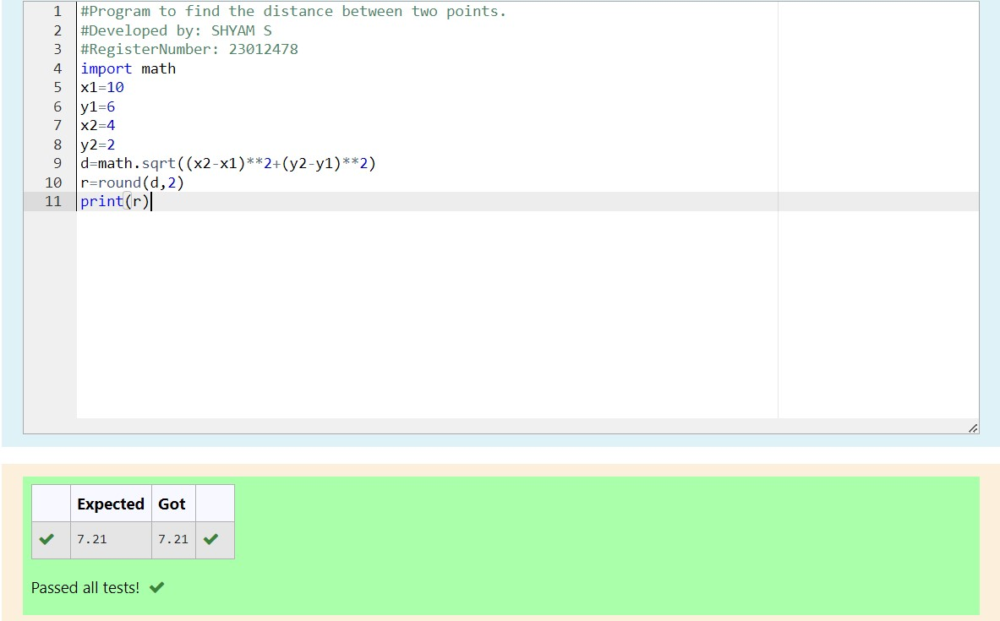

# DISTANCE-BETWEEN-TWO-POINTS

## AIM:
To write a python program to find the distance two 2 points
## ALGORITHM:
### Step 1: 
### Step 2: 
### Step 3: 
Substitute the values in the distance formula  
### Step 4: 
### Step 5: 
### PROGRAM:
```
# Program to find the distance between two points.
# Developed by: SHYAM S
# RegisterNumber: 23012478
import math
x1=10
y1=6
x2=4
y2=2
d=math.sqrt((x2-x1)**2+(y2-y1)**2)
r=round(d,2)
print(r)
```  


### OUTPUT:



### RESULT:
